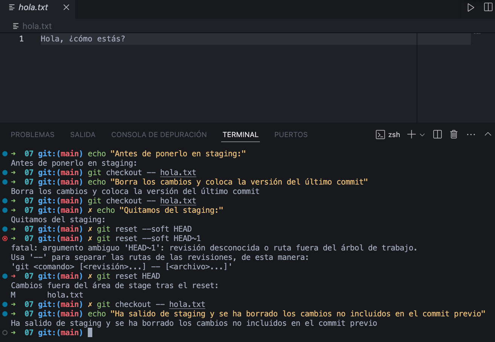

# Ejercicio 07: Deshacer Cambios

Deshacer cambios que no queremos mantener en el repositorio.

---

1. Modifica un archivo existente sin añadirlo al staging.

2. Usa git checkout -- <archivo> para deshacer los cambios.

3. Haz un cambio, añádelo al staging con git add, y deshaz el staging con git reset HEAD <archivo>.

4. Verifica que el archivo vuelve al estado anterior.

## Solución: 

